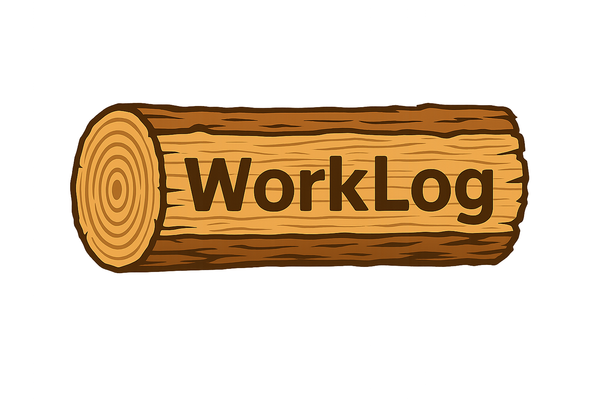

<div align="center">
  
</div>

# WorkLog (Mobile)

A cross-platform **time & project management** app for small teams (≤ ~50 workers) built with **Expo + React Native**.  
WorkLog lets **employers** create projects and track their own shifts, while **workers** clock in/out with location verification. Data is stored locally for MVP; cloud sync can be added later.

## ✨ Features (MVP)

### Worker
- **Login with Employee Number + Password**
  - First-time registration via *“Initial Registration”* (Full Name, Israeli ID, Employer Number + chosen password).
  - “Forgot Password” resets to the worker’s **ID number**.
- **Time Clock**
  - Clock **in/out** with GPS validation: within a configured radius of the job site.
  - Shows live elapsed time; saves start time, end time, and **human-readable address** (street + city).
- **Personal Info / History**
  - Month/Year selector to view past shifts.
  - Monthly total hours + list of shifts: `[Date, Duration, Location]`.

### Employer
- **Employer Login** (Employer Number + Password) & **Initial Registration** (company name + password).
- **Employer Home** with side menu (open/close):
  - **Time Clock** for employer (with seconds HH:MM:SS).
  - **Personal Info**: month/year selector + monthly total + shift list.
  - **My Workers**: list of all workers (sorted by oldest → newest), showing **total hours (all time)** per worker.
  - **My Projects**:
    - Create a project with **Name** + **Location**.
    - See project list with creation date, open a project details page.
    - Project page: **Add Media** (camera, gallery, file), view media list, select & **delete** media.

> Logo is shown from `assets/logo.png` anywhere the app name would normally appear.

---

## 🧱 Tech Stack

- **React Native** (Expo)
- **expo-router** (navigation)
- **AsyncStorage** (local storage for MVP)
- **expo-location** (GPS + reverse geocoding)
- **expo-image-picker** (camera + gallery)
- **expo-document-picker** (file picker)

---

## 📂 Project Structure (high level)

```
app/
  _layout.tsx
  auth.tsx                # Worker login + initial registration
  employer-auth.tsx       # Employer login + initial registration
  employer-home.tsx       # Employer dashboard + side menu & sections
  employer-project.tsx    # Project details + media management
  clock.tsx               # Worker’s time clock (existing)
  profile.tsx             # Worker’s personal info w/ month-year filter
assets/
  logo.png                # App logo used in headers
src/
  lib/
    storage.ts            # Employers, Workers, Punches, Projects, Media (AsyncStorage)
    location.ts           # Location helpers, reverse geocode, distance
```

---

## ⚙️ Setup

```bash
# 1) Install dependencies
npm install

# 2) Make sure required Expo libs are installed
npx expo install expo-location expo-image-picker expo-document-picker @react-native-async-storage/async-storage

# 3) Start the app
npx expo start
```

### App config (already included)
`app.json` includes camera/photo/library/location permissions and `"expo-image-picker"` plugin.

---

## 📍 Location Rules (MVP)

- Clock in/out is allowed **only** within a configured radius of the job site.
- Constants (in `app/employer-home.tsx` and `app/clock.tsx`):
  ```ts
  const SITE_LAT = 32.1105;
  const SITE_LNG = 34.9845;
  const RADIUS_M = 4000;  // 4km for testing
  const ACCURACY_MAX = 75; // meters
  ```
- Reverse geocoding displays **street, city** when available.

> Adjust these values for your real site coordinates and radius.

---

## 🔐 Auth & Data (MVP notes)

- **Local-only** storage (AsyncStorage). No server or cloud sync yet.
- Worker passwords are plain text (MVP!) → should be replaced with proper auth in production.
- Employer/Worker numbers are generated locally and unique per device.

---

## 🧭 Worker Flow

1. Open the app → Worker login screen.
2. If first time, tap **“Initial Registration”**:
   - Enter Full Name, Israeli ID, Employer Number, choose a Password.
   - You’ll receive your **Employee Number** (also shown in your profile).
3. Log in with **Employee Number + Password**.
4. Use the **Clock** to start/finish the shift.  
   Your **Personal Info** shows monthly totals and shift history.

---

## 🧭 Employer Flow

1. Go to **Employer Login** (top-right on worker login screen).
2. Either log in or do **“Initial Registration”** (company + password).
3. In **Employer Home**, use side menu:
   - **Clock** (employer)
   - **Personal Info** (month/year)
   - **My Workers** (total hours per worker, all time)
   - **My Projects** (create + open projects)
4. In **Project page**:
   - **Add Media**: pick **Camera / Gallery / File**
   - See media list and delete selected items.

---

## 🧭 Roadmap (Next steps)

- **Cloud backend**: Supabase/Postgres with RLS or Firebase for:
  - Employers, Workers, Projects, Media, Punches (with sync).
- **Auth**: Proper authentication, passwords hashing, sessions/JWT.
- **Multiple job sites** & per-project geofencing.
- **Offline sync** + conflict resolution.
- **Payroll exports** (CSV/Excel/PDF) & configurable pay rules.
- **Project media**: thumbnails, previews, full-screen viewer, tagging, comments.
- **Roles & permissions** (owner, manager, worker).
- **Push notifications** (reminders, shift confirmations).
- **Analytics & dashboards** (per project/worker/month).
- **Localization** (EN/HE), **Accessibility**, **Dark mode** polish.
- **Testing** (unit/E2E) + **CI/CD** (EAS Build, automatic releases).

---

## 🐛 Troubleshooting

- **VirtualizedLists inside ScrollView warning**  
  Fixed by rendering each list inside its own `FlatList` + `ListHeaderComponent` (no `ScrollView` wrapping lists).
- **Location denied**  
  Ensure you accepted permissions and you’re within `RADIUS_M` meters of `SITE_LAT/LNG`.
- **Media pickers**  
  Accept camera/photo/files permissions when prompted.

---

## 🤝 Contributing

PRs and discussions are welcome! For now this is an MVP; guidelines will be added after backend integration.

---

## 🛡️ License

TBD (recommend MIT). Add a `LICENSE` file if you want open-source.
